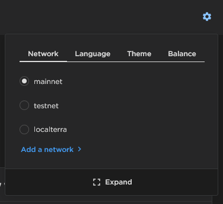

# What is Setten

Setten is Blockchain as a Service company dedicated to the Terra blockchain.

With Setten, you can access the Terra network with fast and reliable performance in only a few clicks. Spend less time on your infrastructure and more time building your project.


**Are you looking for feature requests and community discussions?**

You can request and vote for features, give feedback, and receive community support [here](https://github.com/orgs/setten-io/discussions). Talk to you soon!


## Get started in two minutes

### Developer

<details>

<summary>Create and account</summary>

1. Log in with Github or register on our [app](https://app.setten.io/login).

</details>

<details>

<summary>Create a new project</summary>

1. On the [Projects](https://app.setten.io/projects) page, click on [Add project](https://app.setten.io/projects/create).
2. Give it a descriptive name and click on "Create".
3. You will get redirected back to the [Project](https://app.setten.io/projects) page and should see your new project.

</details>

<details>

<summary>Get your project id and key</summary>

1. Click on the "Manage" button on your new project.
2. Copy the "Project ID" and "Key" fields.

</details>

<details>

<summary>Use your project endpoint in your code</summary>


```javascript
import { LCDClient } from '@terra-money/terra.js';

const settenProject = "37677fb03e7d426e8ecfd56f36655577"
const settenKey = "4e4a6106c6354339a263d23090559804"

// connect to bombay testnet
const terra = new LCDClient({
  URL: `https://:${settenKey}@bombay.lcd.setten.io/${settenProject}`,
  chainID: 'bombay-12',
});no

// ...
```



```python
import asyncio

from terra_sdk.client.lcd import AsyncLCDClient

SETTEN_PROJECT = "37677fb03e7d426e8ecfd56f36655577"
SETTEN_KEY = "4e4a6106c6354339a263d23090559804"


async def main():
    terra = AsyncLCDClient(f"https://bombay.lcd.setten.io/{SETTEN_PROJECT}", "bombay-12")
    terra.session.headers.add("X-Setten-Key", SETTEN_KEY)
    total_supply = await terra.bank.total()
    print(total_supply)
    # ...
    await terra.session.close()

asyncio.get_event_loop().run_until_complete(main())
```


</details>

### Dapp user

<details>

<summary>Create and account</summary>

1. Log in with Github or register on our [app](https://app.setten.io/login).

</details>

<details>

<summary>Create a new project</summary>

1. On the [Projects](https://app.setten.io/projects) page, click on [Add project](https://app.setten.io/projects/create).
2. Give it a descriptive name and click on "Create".
3. You will get redirected back to the [Project](https://app.setten.io/projects) page and should see your new project.

</details>

<details>

<summary>Get your project id and key</summary>

1. Click on the "Manage" button on your new project.
2. Copy the "Project ID" and "Key" fields.

</details>

<details>

<summary>Add it to Terra Station Wallet</summary>

1. Click on the cogwheel in the top right corner of the extension\
   &#x20;
2. Click on "Add a network >" and fill the fields like so:
   * Name: A descriptive name (no incidence on the network)
   * Chain ID: "columbus-5" for mainnet
   * LCD: `https://:KEY@columbus.lcd.setten.io/PROJECT_ID`\
     ``Be sure to replace KEY and PROJECT\_ID with the key and project id\
     from the last step

&#x20;


</details>

## Guides

Not sure where to start? Check out our guide to set your project on foot:


[Broken link](broken-reference)


## Concepts

Deep dive into Setten's architecture:


[Broken link](broken-reference)

